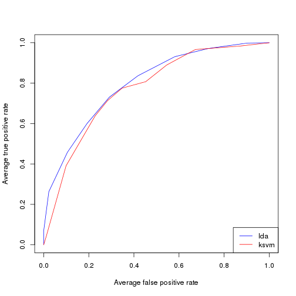
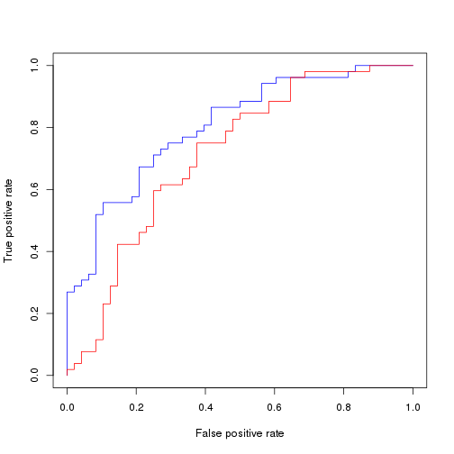

ROC Analysis
============

The receiver operating characteristic curve (ROC) is a graphical plot
for a binary classifier and mainly used in signal detection theory. It
compares the false positive rate (fall-out) on the horizontal axis to
the true positive rate (sensitivity) on the vertical axis by varying
the threshold that determines when a datum will be classified as positive and
when as negative. Sometimes, the costs of misclassification are unknown.
In contrast to other performance measures, where only one performance value can
be calculated, a ROC for one classifier shows an area of
performance values in relation to different false positive and true
positive rates. Another benefit of this graphical plot is the
fact that it can compare the performance of an imbalanced data set
with a modified version. The following functions are created by
including the features of the [ROCR](http://cran.r-project.org/web/packages/ROCR/index.html) package.

Comparing to learners
---------------------

We can compare the performance of two learners in **mlr** with the help of `ROCR`.
First we create a scenario with two different [learners](learner.md) capable of
predicting probabilities (Tip: run `listLearners(prob=TRUE)` to get a list of
all learners that support this).


```splus
## Generate 2 class problem with mlbench
set.seed(1)
testData = as.data.frame(mlbench.2dnormals(100, sd = 2))

## Define a learning task and an appropriate learner
task = makeClassifTask(data = testData, target = "classes")
lrn1 = makeLearner("classif.lda", predict.type = "prob")
lrn2 = makeLearner("classif.ksvm", predict.type = "prob")
```


Afterwards, we perform [resampling](resample.md) to obtain predictions for each fold.

```splus
## Perform a 10-fold cross-validation
rdesc = makeResampleDesc("CV", iters = 10)
r1 = resample(lrn1, task, rdesc, show.info = FALSE)
r2 = resample(lrn2, task, rdesc, show.info = FALSE)
```


Now we have to convert each prediction within the resample-result to a ROCR
prediction using the [asROCRPrediction](http://berndbischl.github.io/mlr/man/asROCRPrediction.html) function.
Afterwards we let `ROCR` calculate the performance measures and plot the ROC.
As we have one curve for each learner and each cross validation fold we might want to average the curves from the cross validation by using `avg="threshold"`.
Otherwise, \man[plot.performance] will draw a curve for each fold.
For details, see \man[plot.performance].


```splus
p1 = asROCRPrediction(r1$pred)
p2 = asROCRPrediction(r2$pred)
perf1 = ROCR::performance(p1, "tpr", "fpr")
perf2 = ROCR::performance(p2, "tpr", "fpr")
plot(perf1, col = "blue", avg = "threshold")
plot(perf2, col = "red", avg = "threshold", add = TRUE)
legend("bottomright", legend = c("lda", "ksvm"), lty = 1, col = c("blue", "red"))
```

 


We can also cheat a bit and create pooled ROCs by manually setting the class attribute from the prediction object from `ResamplePrediction` to `Prediction`.

```splus
r1p = r1$pred
r2p = r2$pred
class(r1p) = "Prediction"
class(r2p) = "Prediction"
p1 = asROCRPrediction(r1p)
p2 = asROCRPrediction(r2p)
perf1 = ROCR::performance(p1, "tpr", "fpr")
perf2 = ROCR::performance(p2, "tpr", "fpr")
plot(perf1, col = "blue")
plot(perf2, col = "red", add = TRUE)
```

 


