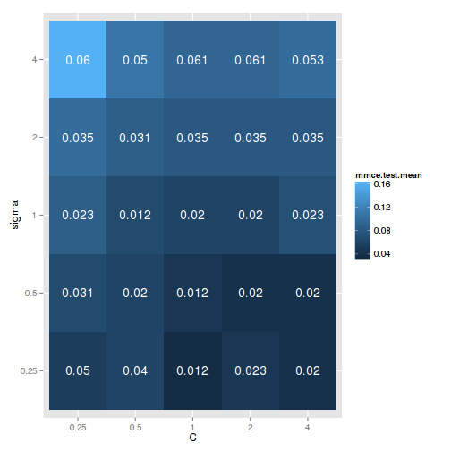
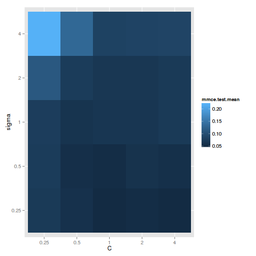

Tuning Hyperparameters
======================

Many machine learning algorithms have hyperparameters that need to be set.
They can either be selected by the user or through resampling,
e.g. cross-validation. Setting them by hand was already covered in the
section about [training](train.md) and [resampling](resample.md) -- simply use the
`par.val` argument in the [makeLearner](http://berndbischl.github.io/mlr/man/makeLearner.html) method.

Grid search is one of the standard -- albeit slow -- ways to choose an
appropriate set of parameters from a given range of values.


Classification example
----------------------

We again use the ``iris`` data set, included in R, but now we want to
set the parameters of a SVM with a polynomial kernel.

### Simple Grid Search with cross validation

We start by loading the *mlr* package and creating a classification
task (see the part on [training](train.md) for more information):


```splus
library("mlr")
task = makeClassifTask(data = iris, target = "Species")
```


Next, we need to create a [ParamSet](http://berndbischl.github.io/mlr/man/makeParamSet.html) object that describes
the parameter space we wish to search. This is done through the function
[makeParamSet](http://berndbischl.github.io/mlr/man/makeParamSet.html). We add discrete parameters for the `C` and `sigma` parameter
of the SVM to the parameter set. More details concerning parameter sets are
explained in section
[parameters](parameters.md).


```splus
ps = makeParamSet(makeDiscreteParam("C", values = 2^(-2:2)), makeDiscreteParam("sigma", 
    values = 2^(-2:2)))
```


We will use cross-validation to assess the quality of a specific parameter
setting. For this we need to create a resampling description just
like in the [resampling](resample.md) part of the tutorial:


```splus
rdesc = makeResampleDesc("CV", iters = 3)
```


Before we can actually tune our classifier and identify the best parameter
setting, we need an instance of a [TuneControl](http://berndbischl.github.io/mlr/man/TuneControl.html) object. These describe the
optimization strategy used. Here we use a grid search:


```splus
ctrl = makeTuneControlGrid()
```


Finally, combining all the previous pieces, we can tune the SVM
using our [TuneControl](http://berndbischl.github.io/mlr/man/TuneControl.html) instance and the resampling strategy
described by the `rdesc` variable.


```splus
r = tuneParams(makeLearner("classif.ksvm"), task = task, resampling = rdesc, 
    par.set = ps, control = ctrl, measures = list(mmce, setAggregation(mmce, 
        test.sd)))
```

```
## [Tune] Started tuning learner classif.ksvm for parameter set:
##           Type len Def         Constr Req Trafo
## C     discrete   -   - 0.25,0.5,1,2,4   -     -
## sigma discrete   -   - 0.25,0.5,1,2,4   -     -
## With control class: TuneControlGrid
## Imputation value: 1Imputation value: Inf
## [Tune] 1: C=0.25; sigma=0.25 : mmce.test.mean=0.0533,mmce.test.sd=0.0503
## [Tune] 2: C=0.5; sigma=0.25 : mmce.test.mean=0.06,mmce.test.sd=0.04
## [Tune] 3: C=1; sigma=0.25 : mmce.test.mean=0.0333,mmce.test.sd=0.0115
## [Tune] 4: C=2; sigma=0.25 : mmce.test.mean=0.0467,mmce.test.sd=0.0231
## [Tune] 5: C=4; sigma=0.25 : mmce.test.mean=0.04,mmce.test.sd=0.02
## [Tune] 6: C=0.25; sigma=0.5 : mmce.test.mean=0.0667,mmce.test.sd=0.0306
## [Tune] 7: C=0.5; sigma=0.5 : mmce.test.mean=0.06,mmce.test.sd=0.02
## [Tune] 8: C=1; sigma=0.5 : mmce.test.mean=0.0467,mmce.test.sd=0.0115
## [Tune] 9: C=2; sigma=0.5 : mmce.test.mean=0.04,mmce.test.sd=0.02
## [Tune] 10: C=4; sigma=0.5 : mmce.test.mean=0.04,mmce.test.sd=0.02
## [Tune] 11: C=0.25; sigma=1 : mmce.test.mean=0.0867,mmce.test.sd=0.0231
## [Tune] 12: C=0.5; sigma=1 : mmce.test.mean=0.0667,mmce.test.sd=0.0115
## [Tune] 13: C=1; sigma=1 : mmce.test.mean=0.06,mmce.test.sd=0.02
## [Tune] 14: C=2; sigma=1 : mmce.test.mean=0.06,mmce.test.sd=0.02
## [Tune] 15: C=4; sigma=1 : mmce.test.mean=0.0733,mmce.test.sd=0.0231
## [Tune] 16: C=0.25; sigma=2 : mmce.test.mean= 0.1,mmce.test.sd=0.0346
## [Tune] 17: C=0.5; sigma=2 : mmce.test.mean=0.0867,mmce.test.sd=0.0306
## [Tune] 18: C=1; sigma=2 : mmce.test.mean=0.08,mmce.test.sd=0.0346
## [Tune] 19: C=2; sigma=2 : mmce.test.mean=0.08,mmce.test.sd=0.0346
## [Tune] 20: C=4; sigma=2 : mmce.test.mean=0.08,mmce.test.sd=0.0346
## [Tune] 21: C=0.25; sigma=4 : mmce.test.mean=0.16,mmce.test.sd=0.06
## [Tune] 22: C=0.5; sigma=4 : mmce.test.mean=0.107,mmce.test.sd=0.0503
## [Tune] 23: C=1; sigma=4 : mmce.test.mean=0.0933,mmce.test.sd=0.0611
## [Tune] 24: C=2; sigma=4 : mmce.test.mean=0.0933,mmce.test.sd=0.0611
## [Tune] 25: C=4; sigma=4 : mmce.test.mean= 0.1,mmce.test.sd=0.0529
## [Tune] Result: C=1; sigma=0.25 : mmce.test.mean=0.0333,mmce.test.sd=0.0115
```


We used a trick, also described [here](multicriteria_evaluation.md), to
obtain the standard deviation in addition to the default by adding a second
measure. A quick visualization of the Grid Search can be achieved by accessing
the ``opt.path`` as follows.


```splus
library(ggplot2)
head((opt.grid = as.data.frame(r$opt.path)))
```

```
##      C sigma mmce.test.mean mmce.test.sd dob eol error.message exec.time
## 1 0.25  0.25        0.05333      0.05033   1  NA          <NA>     0.066
## 2  0.5  0.25        0.06000      0.04000   2  NA          <NA>     0.064
## 3    1  0.25        0.03333      0.01155   3  NA          <NA>     0.063
## 4    2  0.25        0.04667      0.02309   4  NA          <NA>     0.063
## 5    4  0.25        0.04000      0.02000   5  NA          <NA>     0.063
## 6 0.25   0.5        0.06667      0.03055   6  NA          <NA>     0.064
```

```splus
g = ggplot(opt.grid, aes(x = C, y = sigma, fill = mmce.test.mean, label = round(mmce.test.sd, 
    3)))
g + geom_tile() + geom_text(color = "white")
```

 


Let's take a closer look at the example above. The parameter grid has to be a
named list and every entry has to be named according to the corresponding
parameter of the underlying R function (in this case "ksvm" from the kernlab
package, see its respective help page). The value of each entry is a vector of
feasible values for this hyperparameter. The complete grid is simply the
cross-product of all feasible values.

Please note that whenever parameters in the underlying R functions should be 
passed within a list structure, **mlr** tries to give you direct access to
each parameter and get rid of the list structure. This is the case for example
with `ksvm`.

Tune now simply performs the cross-validation for every element of the
cross-product and selects the one with the best mean performance
measure.

Unfortunately, it's not clear how reliable the results are. One might
want to find out if the configurations vary for slightly different data sets.
A good approach for getting a better feeling of the best parameter setting
is a nested cross-validation.

### Nested Cross Validation

Let's run a nested CV with 5 folds in the outer loop and 3 folds in the
inner loop on the above example.


```splus
task = makeClassifTask(data = iris, target = "Species")
ps = makeParamSet(makeDiscreteParam("C", values = 2^(-2:2)), makeDiscreteParam("sigma", 
    values = 2^(-2:2)))
ctrl = makeTuneControlGrid()

rin = makeResampleDesc("CV", iters = 3)
rout = makeResampleDesc("CV", iters = 5)

lrn = makeTuneWrapper(makeLearner("classif.ksvm"), resampling = rin, par.set = ps, 
    control = ctrl, show.info = FALSE)
```


Now we can run our nested CV. For further evaluations, we may
want to extract the results of the tuning run as well. Please note that storing
entire models may be expensive.


```splus
r = resample(lrn, task, resampling = rout, extract = getTuneResult, show.info = FALSE)
```


Finally, we can compare the results obtained in the different iterations. We
receive one optimal setting for each of the 5 outer folds, including the
corresponding mmce on the inner cross-validations:


```splus
r$extract
```

```
## [[1]]
## Tune result:
## Op. pars: C=0.25; sigma=0.25
## mmce.test.mean=0.0417
## 
## [[2]]
## Tune result:
## Op. pars: C=1; sigma=0.25
## mmce.test.mean=0.0167
## 
## [[3]]
## Tune result:
## Op. pars: C=0.25; sigma=0.25
## mmce.test.mean=0.05
## 
## [[4]]
## Tune result:
## Op. pars: C=0.5; sigma=0.25
## mmce.test.mean=0.0333
## 
## [[5]]
## Tune result:
## Op. pars: C=2; sigma=0.25
## mmce.test.mean=0.0417
```


As you can see, the optimal configuration usually depends on the data. You may
be able to identify a *range* of parameter settings that achieve good
performance though, e.g. the values for C should be at least 1 and the values
for sigma should be between 0 and 1.

If we want to find out how good those configurations are on the entire data
set, we can still look at the measures that we already know from
[Resampling](resample.md).


```splus
r$measures.test
```

```
##   iter    mmce
## 1    1 0.00000
## 2    2 0.10000
## 3    3 0.00000
## 4    4 0.03333
## 5    5 0.03333
```

```splus
r$aggr
```

```
## mmce.test.mean 
##        0.03333
```


Thus, we receive 5 misclassification errors (one for each optimal parameter
configuration per outer fold) and one aggregated version, i.e. the mean,
of those 5 values.

#### Visualization

To extract the `opt.path`s we have to access the inner cross validations.


```splus
opt.paths = lapply(r$extract, function(x) as.data.frame(x$opt.path))
opt.mmce = lapply(opt.paths, function(x) x$mmce.test.mean)
opt.grid = opt.paths[[1]][, 1:2]
opt.grid$mmce.test.mean = apply(simplify2array(opt.mmce), 1, mean)
g = ggplot(opt.grid, aes(x = C, y = sigma, fill = mmce.test.mean))
g + geom_tile()
```

 


Regression example
------------------

Let's tune `k` of a `k`-nearest neighbour regression model (implemented
in package ``kknn``) on the ``BostonHousing`` data set.


```splus
library("mlbench")
data(BostonHousing)

task = makeRegrTask(data = BostonHousing, target = "medv")

## Range of the value k
ps = makeParamSet(makeDiscreteParam("k", 1:7))

## Evaluate with 5-fold cross-validation
rdesc = makeResampleDesc("CV", iters = 5)

## Create a grid tuner:
ctrl = makeTuneControlGrid()

## Create a learner:
lrn = makeLearner("regr.kknn")

## Tune k-nearest neighbour regression with mean squared error as default
## measure
tuneParams(learner = lrn, task = task, resampling = rdesc, par.set = ps, control = ctrl, 
    measures = mse)
```


<!--(
.. |tune-varsel_processing| image:: /_images/tune-varsel_processing.png
     :align: middle
     :width: 50em
     :alt: Variable selection as a tuning.
     
)-->
